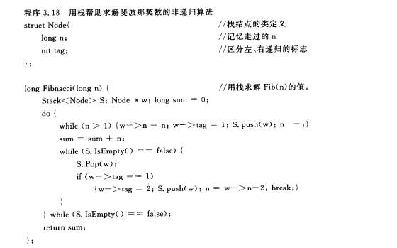

## 递归

### 定义

若一个对象部分地包含自己，或用它自己给自己定义，则称这个对象是递归的；而且若一个过程直接或间接地调用自己，则称这个过程是递归的过程。

### 使用场合

- 定义是递归的

  

  

  从递归定义的例子中，我们可以得到以下三点认识：

  - 对于一个较为复杂的问题，如果能够分解成几个相对简单的且解法相同或类似的子问题时，只要解决这些子问题，那么原问题就迎刃而解了。这就是分治法。
  - 当分解后的子问题可以直接解决时，就停止分解。**递归结束条件**
  - 递归定义的函数可以用递归过程编程求解。**递归过程直接反映了定义的结构**

  

- 数据结构是递归的

  链表、二叉树等

- 问题的解法是递归的

  比如Hanoi问题，分析它的递归树，就可以解析理解整个递归的过程。

## 递归过程与递归工作栈

为了保证递归过程每次调用和返回的正确执行，必须解决调用时的**参数传递**和**返回地址问题**。

###  1.	递归工作栈

###  2.	用栈实现递归过程的非递归算法




### 用迭代法实现递归过程


**事实上，一般对尾递归或单向递归的情形，都可利用迭代的方法，将递归过程改为非递归过程。**


### 回溯法迷宫问题


## 经典问题

### Hanoi

Hanoi的问题，每次都可以是将n个塔从A->C，转化为将n-1个从A->B， 再n-1个从B->C的子问题


递归分析树


上下层表示程序调用关系，同一模块的各子模块从左向右顺序执行。


递归实现：

```c
void Hanoi(int n, string A, string B, string C) {
	if(n == 1) {
		cout << A << " -> " << C << endl; 
	}
	else {
		Hanoi(n-1, A, C, B);
		cout << A << " -> " << C << endl;
		Hanoi(n-1, B, A, C);
	}
}
```

非递归实现：


## 题型

一、给定递归定义的式子，写出非递归的算法

$$ P_n(x)=\left\{ \begin{matrix} 1,n=0\\2x，n=1 \\ 2xP_{n-1}(x) - 2(n-1)P_{n-2}(x)，n>1  \end{matrix} \right. $$ 

思路：发现这是尾递归，可以使用迭代法。每个值都是又前两个值计算得到，可以使用两个变量f1,f2交替处理。

```c
struct stack {
    int no;
    double val;
}st[MaxSize];

double p(int n, double x) {
	int top = -1, i;
    double f1 = 1, f2 = 2 * x;
    for(i = n; i >= 2; i--) {
        top++;
        st[top].no = i;
    }
    while(top >= 0) {
        st[top].val = 2*x*f2 - 2*(st[top].no - 1) * f1;
        f1 = f2;
        f2 = st[top].val;
        top--;
    }
    if(n == 0) {
        return f1;
    }
    return f2;
}
```


非尾递归，先画出递归树


