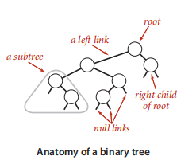
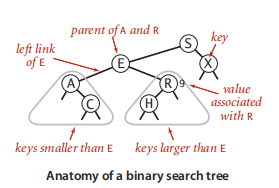

## define

A binary tree is a either a null link or a node with a left link and a right link，each references to (disjoint) subtrees that are themselves binary trees.

## basic terminology

## Definetion

A binary seach tree(BST) is a binary tree where each node has a **Comarable key**(and an associated value) and satisfies **the restrication** that the key in any node is larger then the keys in all nodes in that node's left subtree and smaller then the keys in all nodes in that node's right subtree.

## Basic implementation

## 

