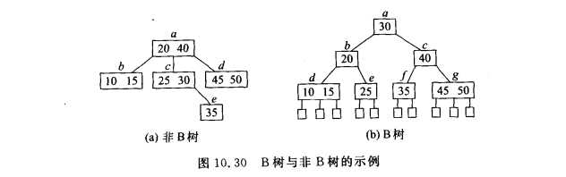
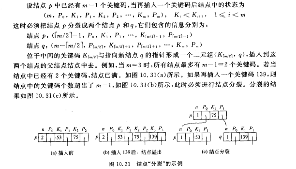
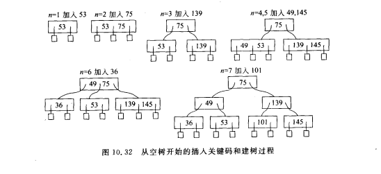
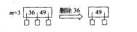
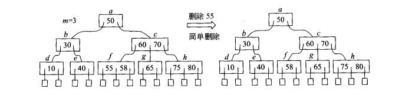
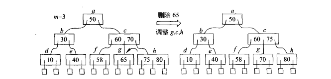
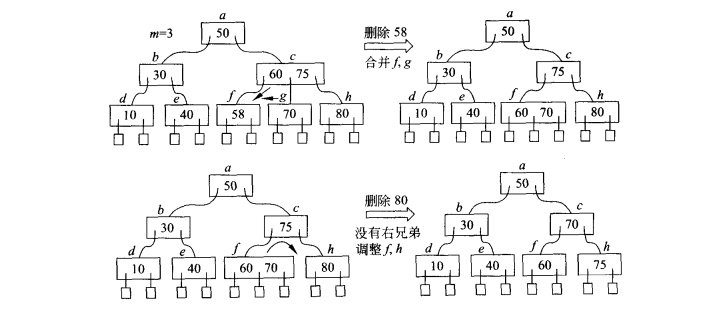
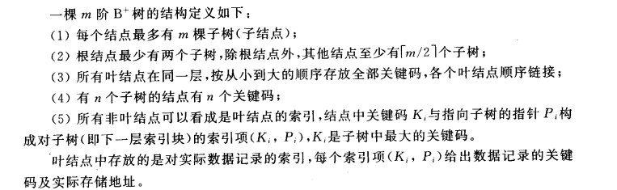

# B树


## 定义

一颗m阶B树(balanceed tree of order m)是一颗平衡的m路搜索树，它或者是空树，或者是满足下列性质的树：

- 根节点至少有两个子女
- 除根节点以外的所有结点(不包括失败结点)至少有$\lceil m/2 \rceil$个子女
- 所有失败结点都位于同一层，且不带信息(虚拟的，空的)

**B树是所有结点的平衡因子均等于0的多路平衡查找树**



仅当关键码个数等于$2^{k}-1(k是大于0的整数)$，才存在2阶B树。但是，对于任何$n \geq 0$ 和 $m > 2$，都存在包含n个关键码的m阶B树。


## 查找

**B树的搜索过程是一个在结点内搜索和循某一条路径向下一层搜索交替进行的过程。因此，B树的搜索时间与B树的阶数m和B树的高度h直接有关，必须加以权衡。**

在B树上进行搜索，搜索成功所需的时间取决于关键码所在的层次，搜索不成功所需的时间取决于树的高度。**那么高度h与树中的关键码个数N有什么关系呢？**


若设B树的高度为h，则所有失败结点位于第h+1层。(也就是说B树的高度不包括失败结点)

若$n \geq 1$，则对于任意一颗包含n个关键字、高度为h、阶数为m的B树：

**1）假设B树中每个结点最多有m棵子树，m-1个关键字，所以在一棵高度为h的m阶B树中关键字的个数应该满足：**

$n \leq (m-1)(1+m+m^2+...+m^{h-1}) $

即，一共有$(1+m+m^2+...+m^{h-1}) $个结点，每个结点有$m-1$个关键码

关键码总数等于$(m-1)(1+m+m^2+...+m^{h-1})  = (m-1)*{\frac{1(1-m^h)}{1-m}} = m^h - 1$，因此有

$n \leq m^h - 1  \Longrightarrow  h \geq log_m(n+1)$


**2）设m阶B树中，失败结点位于第h+1层。在这棵B树中关键码个数N最小能达到多少呢？**

根据定义第一层至少有一个结点，第二层至少有两个结点，第三次至少有$2\lceil m/2 \rceil$个结点，第h+1层至少有$2(\lceil m/2 \rceil)^{h-1}$个结点

在B树中，**每一层的出度等于从根到该层的关键码数目+1**，所以假设关键码有n个，那么失败结点有n+1个

$n +1 = 失败结点数 = 位于第h+1层的总结点数 \geq 2\lceil m/2 \rceil^{h-1}$

$h \leq log_{\lceil m/2 \rceil}((n+2)/2+1)$

从以上推导可知，提高B树的阶数m，可以减少树的高度，从而减少读入结点的次数，因而可减少读磁盘的次数。但事实上，m会受到内存可使用空间的限制。当m很大超出内存工作容量时，结点不能一次读入到内存，增加了读磁盘次数，也增加了结点内搜索的难度。

B树的查找包括两个操作：

- 在B树上找结点(在磁盘上进行)
- 在结点内找关键字(在内存里进行)


## 插入

​	在B树，每个非失败结点的关键码都在$\lceil m/2 \rceil-1$与$m-1$之间。插入是在某个叶节点(第h层的结点)开始的。如果在关键码插入后结点张的关键码个数超出了上述范围，则结点需要**"分裂"**，否则直接插入即可。

### 实现结点"分裂"的原则



### 建立B树




## 删除

​	如果想在B树上删除一个关键码，首先需要找到该关键码所在的结点，从中删去这个关键码。若该结点不是叶节点，则需要选择该关键码的前继或者后序关键码来代替，最后问题归于在叶结点中删除关键码。

- 情况一

  若被删关键码所在叶结点同时又是根节点且删除前该节点中关键码个数$n \geq 2$，则直接删去该关键码并将修改后的结点写回磁盘，删除结束。

  

- 情况二

  若被删除关键码所在叶节点不是根节点且删除前该结点关键码个数$n \geq \lceil m/2 \rceil$，则直接删去该关键码并将修改后的结点写回磁盘。

  

- 情况三

  被删关键码所在叶结点删除前关键码数$n = \lceil m/2 \rceil - 1$，若这时与该结点相邻的右兄弟(右兄弟没有则左兄弟)结点的关键码个数$n \geq \lceil m/2 \rceil - 1$，则可按以下步骤调整该结点、兄弟结点一级其父节点，以达到新的平衡。

  1）将父节点中刚刚大于(或小于)该被删除关键码的关键码$K_i(1\leq i \leq n)$下移到被删关键码所在结点中；

  2）将右兄弟(或左兄弟)结点中的最小(或最大)关键码上移到父节点的$K_i$位置；

  3）将右兄弟(或左兄弟)结点中的最小(或最大)子树指针平移到被删关键码所在结点中最后(或最前)子树指针位置；

  4）在右兄弟(或左兄弟)结点中，将移走的关键码和指针位置用剩余的关键码和指针填补、调整，再将结点中的关键码个数减一。

  

  

- 情况四

  被删关键码所在叶节点删除前关键码个数$n = \lceil m/2 \rceil - 1$，若这时与该结点相邻的右兄弟(或左兄弟)结点的关键码个数$n = \lceil m/2 \rceil - 1$，则必须按以下步骤合并这两个结点。

  1)将父节点p中相应关键码下移到选定保留的结点中。若要合并p中的子树指针$P_i$与$P_{i+1}$所指的结点，且保留$P_i$所指结点，则把p中的关键码$K_{i+1}$下移到$P_i$所指的结点中。

  2）把p中子树指针$P_{i+1}$所指结点中的全部指针和关键码都照搬到$P_i$所指结点的后面。删去$P_{i+1}$所指的结点。

  3）在父节点p中用后面剩余的关键码和指针填充关键码$K_{i+1}$和指针$P_{i+1}$。

  4）修改父节点p和选定保留结点的关键码个数

  

  **在合并结点的过程中，父节点中的关键码减少了。**

  - 若父节点是根节点

    1）父节点关键码个数减少到0，则该父节点应从树上删去，合并后保留的结点成为新的根节点；

    2）否则将父节点与合并后保留的结点都写回磁盘，删除处理结束。

  - 若父节点不是根节点

    若父节点关键码个数减少到$\lceil m/2 \rceil -2$，又要与它自己的兄弟结点合并，重复上面的合并步骤。

  

  ```
  按照给定规则，跟右兄弟(或做兄弟)合并
  将父节点的Ki+1下移到要删除的关键码，然后将Pi+1的所有关键码接到Pi后面，删掉Pi+1,然后将Ki+2,Pi+2等往前移动接替前面的位置。
  
  操作完后，可能导致父节点的关键码少于要求的数目，所以需要将焦点转移到父节点，接着上诉合并操作，直到结束。
  ```

  


## B树的应用场景

数据库和文件系统

## 简单实现

## 题型

1、给定一些列关键码要求进行建树、插入或删除等操作

2、关于性质的数学计算：

- 已知具有n个关键码的m阶B树，应有$n+1$个失败结点

- 已知高度为h的m阶B树，至少有$1+2\frac{ \lceil m/2 \rceil^{h-1} - 1}{\lceil m/2 \rceil - 1}$个结点，至多有$\frac{m^h-1}{m-1}$个结点
- 含有n个非叶结点的m阶B树中至少包含$(n-1) (\lceil m/2 \rceil - 1) + 1$个关键码，至多包含$(n-1)(m-1)$
- 已知m阶B树中共有n个关键字，则树的高度取值范围是：$log_m(n+1) \leq h \leq log_{\lceil m/2 \rceil}{[(n+1)/2]} + 1$
- 已知高度为h的m阶B树，其所包含关键码的个数至少是$2 \lceil m/2 \rceil^{h-1}-1$，至多是$m^h - 1$
- 已知高度为h的m阶B树，加上某些限制条件，求该树的结点数目范围


## B+树

最大关键码复写




