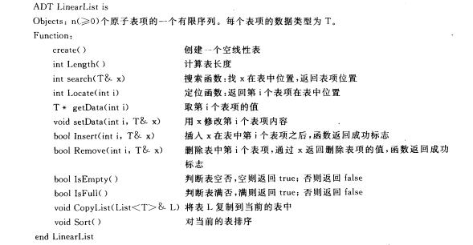

概述

表头、表尾

线性表是一个有限序列。在线性结构中，结点之间的邻接关系是1对1的，即每个结点至多只有一个直接前驱并且至多只有一个直接后继。

线性表的抽象数据结构




单链表实现的四种方式

插入

```
头插
尾插
中间(ai之前，ai之后)
```

删除

```
头删
中间或尾部删除
```

带头节点的插删


已知单链表的某个结点很难直到链表的所有结点，单链表很难操纵前驱结点

-> 循环链表，双向链表