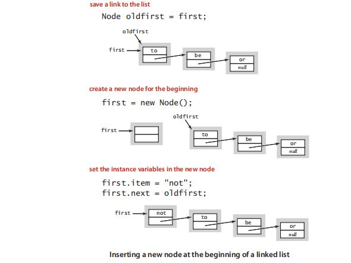
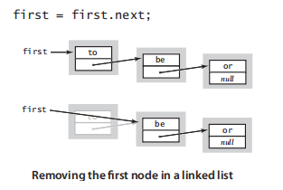
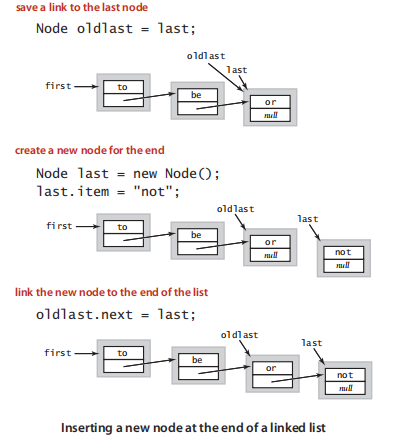
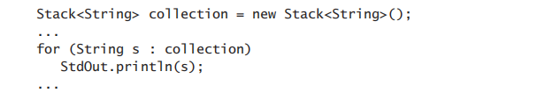
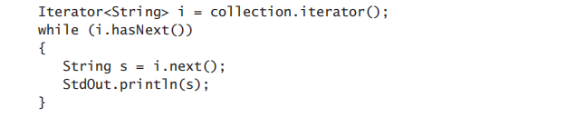

Linked lists

In order to avoid the linear cost of insertion and deletion.

##  Definition

**A linked list is a recursive data structure that is either empty(null) or a reference to a node having a generic item and a reference to a linked list.**


## Node record

We start with a **nested class** that defines the node abstraction：

```java
private class Node {
    Item item;
    Node next;
}
```


## Build a linked list

​	Now, from the recursive definition, we can represent a linked list with a variable of type Node simply by ensuring that its value is either null or a reference of a Node whose next field is a reference to a linked list.  For example, to build a linked list that contains the items to, be, and or, we create a Node for each item: 


​	The deference between array and lined list is linked list is easier to insert items into the sequence and remove items from the sequence.

## Insert in the beginning

​	First, suppose that you want to insert a new node into a linked list. The easiest place to do so is at the beginning of the list. **For example, to insert the string not at the beginning of a given linked list whose fifirst node is first, we save first in oldfirst, assign to first a new Node, and assign its item fifield to not and its next fifield to oldfirst.** This code for inserting a node at the beginning of a linked list involves just a few assignment statements, so the amount of time that it takes is independent of the length of the list. 



## Remove from the beginning

Next, suppose that you want to remove the fifirst node from a list. **This operation is even easier: simply assign to first the value first.next**. Normally, you would retrieve the value of the item (by assigning it to some variable of type Item) before doing this assignment, because once you change the value of first, you may not have any access to the node to which it was referring. Typically, the node object becomes an orphan, and the Java memory management system eventually reclaims the memory it occupies. Again, this operation just involves one assignment statement, so its running time is independent of the length of the list.



## Insert in the end




## Insert / Remove at the other position


one of the fundamental operations on collections is to process each item by $iterating$ through the collection using Java's $foreach$ statement.This paradigm leads to clear and compact code that is free from dependence on the details of a collection’s implementation. To consider the task of implementing iteration, we start with a snippet of client code that prints all of the items in a collection of strings, one per line:



Now, this foreach statement is shorthand for a while construct (just like the for statement itself). It is essentially equivalent to the following while statement:



This code exposes the ingredients that we need to implement in any iterable collection: 

- The collection must implement an iterator() method that returns an Iterator object. 
- The Iterator class must include two methods: hasNext() (which returns a boolean value) and next() (which returns a generic item from the collection).

```
简而言之，只要我们的集合数据结构实现了iterator，就可以使用foreach来迭代遍历集合元素

iterator
比如LinkedList 使用接口ListIterator -> Iterator


Collection:
1-泛型
2-集合大小的变化(动态数组还是链表)
3-对象游离(垃圾回收)
4-迭代(实现Iterator)
```


