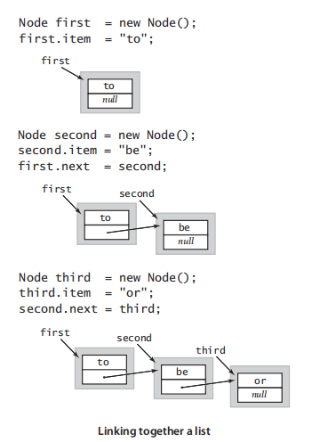

Linked lists

In order to avoid the linear cost of insertion and deletion.

##  Definition

**A linked list is a recursive data structure that is either empty(null) or a reference to a node having a generic item and a reference to a linked list.**


## Node record

We start with a **nested class** that defines the node abstraction：

```java
private class Node {
    Item item;
    Node next;
}
```


## Build a linked list

Now, from the recursive definition, we can represent a linked list with a variable of type Node simply by ensuring that its value is either null or a reference of a Node whose next field is a reference to a linked list.  For example, to build a linked list that contains the items to, be, and or, we create a Node for each item: 



The deference between array and lined list is linked list is easier to insert items into the sequence and remove items from the sequence.

## Insertion

### Insert in the beginning


## Traversal

## remove


