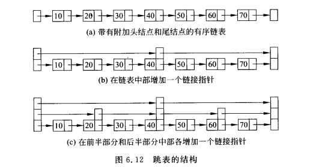

跳表

建立、查找、插入、删除

## 查找

1、严格按照每两个点就创建一个索引

复杂度分析：

显然如果采用(c)图所示的三级链结构，对所有的搜索至多需要**三次**比较。每层最多三次

一个有n个元素的跳表理想情况下的链级树为$log_2{N}$

2、放松要求，每个结点创建索引的概率用抛硬币还决定

插入删除要维持理想状态的代价太大。

## 插入

先找到要插入的位置，再根据coin决定该结点的层次，最后将各个层次链接起来

## 删除

将该节点及其对应的元素删除

