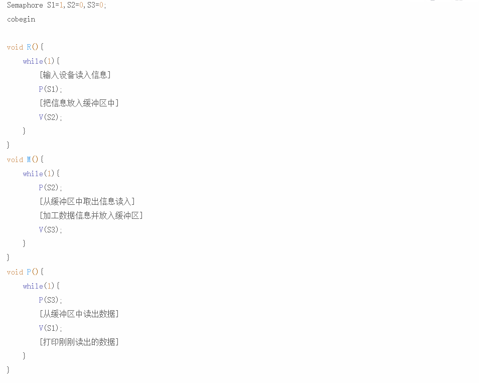
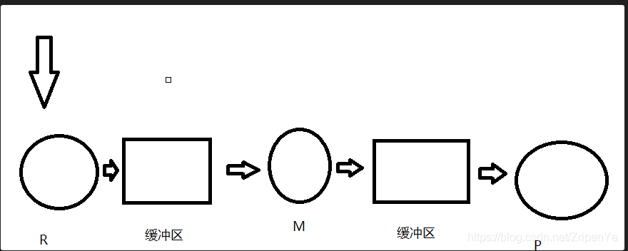
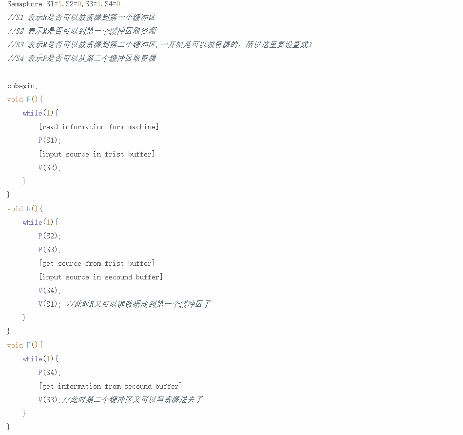

题目一：

面包师有很多面包，由n名销售人员推销。每名顾客进店后取一个号，并且等待叫号，当一名销售人员空闲时，就叫下一个号。试设计一个使销售人员和顾客同步的算法。

分析：

```
n名销售人员，m名顾客
显然m名顾客是临界资源，需要设置matux来实现互斥，使用count来计算阻塞的销售人员数目

collection consumers;
blockqueue bq;

handle {
    
    P(matux)
    	if(consumers is not empty)
    		pick a consumer;
    V(matux)
    
}
```

answer

```java
顾客进店取号，并等待叫号；销售人员空闲后也按序取号，并销售面包。因此同步算法只要对顾客取号和销售人员叫号进行合理同步即可。

int i=0, j=0;
semaphore mutex_i = 1, mutex_j = 1;

Consumer() {
    P(mutex_i);
    i++;
    V(mutex_i);
}

Seller() {
    while(1) {
        P(mutex_j);
        if(j<i) {
            j++;
        }
        V(mutex_j);
    }
}

```


题目二

有三个并发进程：R负责从输入设备读入信息块，M负责对信息块进行加工处理，P负责打印输出信息块。现提供：

1）一个缓冲区，可放置K个信息块；

2）两个缓冲区，每个缓冲区可以放置K个信息块。

试用信号量和PV操作写出三个进程正确工作的流程。

分析：

```
先read, 再manage，再print
```










