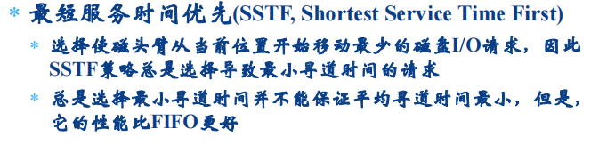
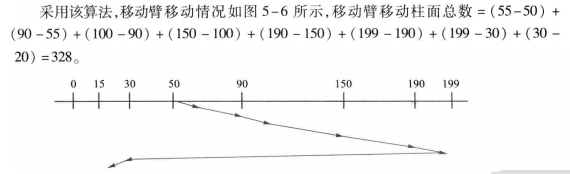

# 设备管理

[TOC]


## 1.	I/O硬件原理

### I/O系统

通常把I/O设备及其接口线路、控制部件、通道和管理软件称为I/O系统。

分类

按I/O操作特性：

- 输入型设备
- 输出型设备
- 存储型设备

按I/O信息交换单位：

- 字符设备：

  输入设备和输出设备(交换单位为字节)

- 块设备：

  存储设备，分为 顺序存储和直接存储

  前者严格依赖信息的物理位置进行定位和读写，如磁带；后者的特点是存储任何一个物理块所需时间几乎不依赖于此信息所处的位置，如磁盘。

  块：存储介质上连续信息所组成的一个区域，块设备每次与内存交换一块或多块信息。

### I/O控制方式

I/O控制是通过软硬件技术对CPU和设备的职能进行合理分工，以平衡系统性能和硬件成本之间的矛盾。分为：轮询、中断、DMA和通道，主要差别在于：CPU和设备并行工作的方式和程度不同。

#### 轮询方式

轮询方式又称为程序直接控制方式，处理器代表给I/O模块发送一个I/O命令，该进程进入忙式等待 (busy-waiting)，等待操作的完成，然后才可以继续操作。

具体过程如下：

1、CPU上运行的程序需要从设备读入一批数据，则CPU程序设置交换字节数和数据读入内存的起始地址

2、然后向设备发出查询指令

3、设备控制器便把状态返回给CPU

4、如果设备忙碌或设备未就绪，则重复测试过程，继续进行查询；否者开始数据传送，CPU从I/O接口(数据寄存器)读取一个字，再用存储指令保存到内存。如果传送尚未结束，再次向设备发出查询指令，直到全部数据传输完成。

评价：

```
1、CPU轮询设备当前的状态会终止原程序的执行，浪费宝贵时间
2、I/O准备就绪后，需要CPU参与数据传输工作
可见CPU和设备只能串行工作，使主机不能充分发挥功效，设备也不能得到合理利用，整个系统效率低
```

#### 中断方式

基本思想：允许I/O设备主动打断CPU的运行并请求服务，从而"解放"CPU，使得其向I/O控制器发送读命令后可以继续做其他有用的工作。

1、处理器代表进程向I/O模块发出一个I/O命令，然后继续执行后续指令，当I/O模块完成工作后，处理器被该模块中断

2、如果该进程不需要等待I/O完成，则后续指令可以仍是该进程中的 指令，否则，该进程在这个中断上挂起，处理器执行其他工作

- 从I/O控制器角度看：

  1）I/O控制器从CPU接收一个读命令，然后从外部设备读取数据。一旦数据读入I/O控制器的数据寄存器，便通过控制线给CPU发出中断信号，表示数据已准备好。然后等待CPU请求该数据。

  2）I/O控制器收到CPU发出的取数据请求后，将数据收到数据总线上，传到CPU的寄存器中。

- 从CPU角度看：

  CPU发出读命令，然后保存当前运行程序的上下文，转去执行其他程序。在每个指令周期的末尾，CPU检查中断。当有来自I/O控制器的中断时，CPU保存当前正在运行程序的上下文，转去执行中断处理程序以及处理当前中断。这时CPU从I/O控制器读**一个字**数据传送到寄存器，并存入主存。

原书：


#### DMA方式

基本思想：在I/O设备和内存之间开辟直接的数据交换通道，实际数据传输操作由DMA直接完成，无需CPU干预。为传送一块数据，处理器给DMA模块发请求，只有当整个数据块传送结束后，处理器才被中断。

相比于中断方式，DMA代替了CPU，控制内存与磁盘之间数据传输。

所需的硬件要求：


为什么控制器从设备读取数据后不立即将其送入内存，而需要内部缓冲呢？

一旦磁盘开始读数据，从磁盘读出比特流的速率是恒定的(转速)，无论控制器是否做好接收这些比特的准备，若此时控制器要将数据直接复制到内存中，必须在每个字传送完毕后获得对系统总线的控制权。如果其他设备也在争用总线，则有可能暂时等待，当上一个字还未送入内存而下一个字已经达到时，控制器另寻暂存之地，如果总线非常忙，则控制器可能需要对大量信息暂存。可见采用内部缓冲区，在DMA操作启动前不需要使用总线，这样控制器的设计就比较简单，因为从DMA到内存的传输对 时间的要求并不严格。

周期窃取：

指利用CPU不访问存储器的那些周期来实现DMA操作，此时DMA可以使用总线而不用通知CPU也不会妨碍CPU的工作 。


周期挪用并不减慢 CPU的操作，但可能需要复杂的时序电路，而且数据传送过程是不连续的和不规则的 

在这种方法中，每当I/O设备发出DMA请求时，I/O设备便挪用或窃 取总线占用权一个或几个主存周期，而DMA不请求时，CPU仍继续访问主存

DMA访问主存有三种可能：

- CPU此时不访存
- CPU正在访存
- CPU与DMA同时请求访存：此时CPU将总线控制权让给DMA 

评价：

DMA传输在窃取时间内让设备和内存之间交换数据，而不再需要CPU干预。(数据块)

缺点：

1）在窃取时间内可能会降低CPU的处理效率，也就是会抢用内存访问；

2）当用户希望一次能够读写多个离散数据块，并把它传送到不同的内存区域或相反，则需要由CPU发出多条启动I/O指令及多次I/O中断处理才能完成。

#### 通道方式

I/O通道是指专门负责输入输出的处理机。

目的：

- 为获得CPU和外围设备间更高的并行工作能力
- 为让种类繁多，物理特性各异的外围设备能以标准的接口连接到系统中

计算机系统引入了**自成独立体系**的通道结构。

```
1、在DMA中，每准备好一个数据块，CPU就得中断一次，所以CPU与设备之间得并行工作能力并不是很理想，考虑能否让I/O操作完成了再让CPU中断呢？
2、各种设备的物理特性可以存在很多差异，这样控制器的种类就会由很多，这样就会导致CPU和控制器的交互变得复杂。为了让cpu简化对I/O操作的干预，假设存在这样的一个东西，当要进行I/O操作的时候，只需CPU对其提供数据大小，地址就行，然后让它去完成对I/O操作的干预，而CPU提供完参数后可以去做其他工作，只需等到它完成I/O操作后，通知CPU中断一次就好了。

----> 通道就相当于 在内存里开一个小的cpu。
```

通道方式主要是解决I/O操作的独立性和硬件部件工作的并行性，由通道来管理和控制I/O操作，大大减少设备和CPU之间的逻辑关系，把CPU从琐碎的I/O操作中**彻底解放**出来，实现设备和CPU并行操作，通道之间并行操作，设备之间并行操作，达到提高整个系统效率的目的。 

具有通道装置的计算机系统的主机、通道、控制器和设备之间关系如下：

```
CPU  ---（I/O指令)---> 通道
通道 --- (通道命令)---> 控制器
控制器 --- (动作序列)---> 设备
```


通道状态字(CSW)

通道状态字是存放在内存固定单元的控制字，专门用于记录通道和设备执行操作的情况 。

- 输入输出中断
- 输入输出指令
  - 启动输入输出指令(SIO)
  - 查询输入输出指令(TIO)
  - 查询通道指令(TCH)
  - 停止输入输出指令(HIO)
  - 停止设备指令(HDV)
- 通道地址字(CAW)

通道地址字是存放在内存固定单元的控制字，专门用于存放通道程序首地址。

通道处理步骤：

- 组织通道程序，通道程序首地址送CAW 
- 执行启动输入输出指令，启动通道工作 
- 通道根据自身状态形成条件码；若通道可用，从CAW中取得通道程序首地址，得到第一条通道指令，启动设备控制     器；设备控制器再检查设备状态；若设备不忙，则告知通道释放CPU
- 通道独立执行通道程序，控制外设进行输入输出 
- 通道完成输入输出后，形成CSW和置中断字寄存器，发出输入输出中断，请求CPU处理


I/O通道与DMA的区别：

DMA方式需要CPU来控制传输的数据块大小、传输的内存为止，而通道方式中这些信息是由通道控制的。另外，每个DMA控制器对应一台设备与内存传递数据，而一个通道可以控制多台设备与内存的数据交互。

I/O通道与一般处理机的区别：

通道指令的类型单一，没有自己的内存，通道所执行的通道程序是放在主机的内存中的，也就是说通道和CPU共享内存。


#### 小结


I/O功能的演化：

1、处理器直接控制外围设备 

2、增加了控制器或者I/O模块

- 处理器使用非中断的可编程I/O 
- 处理器开始从外围设备接口的具体细节中分离出来

3、采用中断方式的控制器或者I/O模块 

- 处理器无需花费等待执行一个I/O操作所需的时间，因而提高了效率

4、I/O模块通过DMA直接控制存储器

- 可以在没有处理器参与的情况下，从主存中移出或者往主存中移 入一块数据，仅仅在传送开始和结束时需要用到处理器 

5、I/O模块被增强为单独的处理器，有专门为I/O设计的指令集

- I/O处理器在没有CPU干涉的情况下取指令并执行这些指令，使得CPU可以指定一些列I/O活动，并只有当整个序列执行完成后CPU才被中断

6、I/O模块有自己的局部存储器，其本身就是一台计算机

例子

```c
采用程序控制方式时，裁缝没有容广的联系方式，客户必须每隔一段时间去裁缝店看看裁缝把衣服做好了没有，这就浪费了容户不少的时间。采用中断方式时，裁缝有容户的联系方式，每当他完成一件衣服后，给客户打一个电话，让客户去拿，与程序直接控制能省去客户不少麻烦，但每完成一件衣服就让客户去拿一次，仍然比较浪费客户的时间。采用DMA 方式时，客户花钱雇一位单线秘书，并向秘书交代好把衣服放在哪里（存放仓库），裁缝要联系就直接联系秘书，秘书负责把衣服取回来并放在合适的位 置，每处理完 100 件衣服，秘书就要给客户报告一次（大大节省了客户的时间)。采用通道方式时，秘书拥有更高的自主权，与 DMA 方式相比，他可以决定把衣服存放在哪里，而不需要客户操心。而且，何时向客户报告，是处理完 100 件衣服就报告，还是处理完 10000 件衣服才报告，秘书是可以决定的。客户有可能在多个裁缝那里订了货，一位DMA 类的秘书只能负责与一位裁缝沟通，但通道类秘书却可以与多名裁缝进行沟通。
```


### 设备控制器

​	I/O设备通常由机械部件和电子部件所组成，一般是将其分开处理，以达到模块化和通用性的设计目标。引入控制器的目的在于通过传递参数就可以执行I/O操作，大大地简化系统的设计，有利于计算机系统对各类控制器和设备的兼容性

设备控制器的主要功能是：

- 接收和识别CPU或通道发来的命令
- 实现数据交换。包括设备和控制器之间的数据传输，且通过数据总线或通道，控制器和内存之间传输数据。
- 发现和记录设备及自身的状态信息，供CPU处理使用
- 设备地址识别


设备控制器必须的组成部分：

- 控制寄存器及译码器
- 数据缓冲寄存器
- 状态寄存器
- 地址译码器及用于对设备操作进行控制的I/O逻辑

## 2. I/O软件原理

### I/O软件设计目标和原则

I/O软件的总体设计目的是**高效率和通用性**，需要考虑的问题有


系统将I/O软件依次组织成4个层次：


### I/O中断处理程序

​	当进程请求I/O操作时，通常被挂起，直到数据传输结束并产生I/O中断时，系统接管CPU后转向中断处理程序执行：

- 检查设备状态寄存器内容，判断产生中断原因
- 根据I/O操作的完成情况进行相应处理
- 若数据传输有错，应向上层软件报告设备出错信息，实施重新执行
- 若正常结束，应唤醒等待传输的进程，使其转换为就绪态
- 若有等待传输的I/O命令，应通知相关软件启动下一个I/O请求

### I/O设备驱动程序

设备驱动程序包括与设备密切相关的所有代码，其任务是把用户提交的逻辑I/O请求转化为物理I/O操作的启动与步骤。同时，监督设备是否正确执行，管理数据缓冲区，进行必要的纠错处理。

```
笼统地说，设备驱动程序的功能是从独立于设备的软件中接收并执行I/O请求
```

I/O设备驱动程序的工作过程：

- 将I/O请求转换为设备要求的具体形式

  它需要确定需要哪些控制命令及执行次序，然后向控制器的设备寄存器写入这些命令和响应参数。

- 设备驱动程序发出控制命令后，系统有两种处理方式

  1）在大多数情况下，执行设备驱动程序的进程需要等待命令完成，在命令开始执行后，进程阻塞自己，直到中断处理时才解除阻塞；

  2）另一种情况是执行驱动程序的进程无需阻塞，例如，有些中断的滚动屏幕，只需向控制器的设备寄存器中写入几个字节，整个操作可在几微妙内完成。

  3）无论是那种情况，在操作完成后都要检查数据传输是否有错，如果有，则返回错误状态提示信息给调用者；如果正常，驱动程序将数据传送给设备无关的软件层；如果I/O请求队列有请求在排队，则选中一个I/O请求执行，否则等待下一个I/O请求的到来。


设备驱动程序主要包含三部分功能：

- 设备初始化。在系统初次启动或设备传输数据时，预置设备和控制器以及通道的状态。
- 执行设备驱动例程。负责启动设备，进行数据传输，对于具有通道的I/O系统，此例程还负责生成通道指令和通道程序，启动通道工作。
- 调用和执行中断处理程序。负责处理设备和控制器及通道所发出的各种中断。

### 独立于设备的I/O软件

设备独立性：指应用程序所用的设备，不局限于使用某个具体的物理设备，也称为设备无关性。

```
两个场景：
1、你的面前有很多个mm，你想找个人和你聊天，此时你自己去那堆mm去找一个
2、你不知道周边有多少个mm，但是有一个人知道很多mm，你想找个人和你聊天，你就委托他帮你找一个。
```

虽然设备驱动程序是设备专用的，但大部分I/O软件却与设备无关，主要是系统提供了独立于设备的I/O软件，其基本功能是执行适用于所有设备的常用I/O功能，并向用户层软件提供一致性接口。


主要功能：

- 执行所有设备的共有操作：

  1）对设备的分配与回收

  2）将逻辑设备名映射为物理设备名

  3）对设备进行保护

  4）缓冲管理

  5）差错控制

  6）提供独立于设备的大小同一的逻辑块，屏蔽设备之间信息交换单位大小和传输速率的差异

- 向用户层(或文件层)提供同一接口


### 用户空间的I/O软件

```
操作系统提供给用户进行I/O操作的接口
```

- 库函数

  

- SPOOLing软件

  

## 3. 缓冲技术

目的：为了缓和CPU和I/O设备速度不匹配的矛盾，减少对CPU的中断频率，提高CPU和I/O设备的并行性。


实现缓冲技术的基本思想：

​	当进程执行写操作输出数据时，先向系统申请一个输出缓冲区，然后将数据送至缓冲区，若是**顺序写请求**，则不断把数据填入缓冲区，直到装满为止，此后进程可以继续计算，同时，系统将缓冲区的内容写到设备上。当进程执行读操作输入数据时，先向系统申请一个输入缓冲区，系统将设备上的一条物理记录读至缓冲区，根据要求把当前所需要的逻辑记录从缓冲区中选中并传送给进程。

```
当满足顺序写的时候，可以放到缓冲区里
输入放到缓冲区里应该是有做什么标记，然后识别读取吧
```

等待：

​	1）输出数据时，仅当系统来不及腾空缓冲区而进程又要写数据；

​	2）输入数据时，仅当缓冲区为空而进程又要从中读数据。

**其他事件可以进一步提高CPU和设备间的并行性，设备和设备间的并行性，从而提高系统效率**

#### 单缓冲区冲区


#### 双缓冲区


用两个缓冲区来交替读(写)

#### 多缓冲区


​	两个缓冲仍然无法解决设备和进程速度不匹配的问题，进程要么处于写等待，要么处于读等待。

​	操作系统从内存区域中分配一组缓冲区，每个缓冲区都有一个链接指针指向下一个缓冲区，最后一个缓冲区指针指向第一个缓冲区，组成循环缓冲，缓冲区的大小等于物理记录的大小，多缓冲的缓冲区是系统的公共资源，可供进程共享并由系统统一分配和管理。

#### 缓冲池


#### 高速缓存(data buffer cache)：

对于磁盘类的直接存取型设备，通常需要按照进程的要求随机地访问数据块，同一数据块可能会被多次访问，为了减少访问磁盘次数，避免数据项重复产生，内核建立一个数据缓冲区高速缓存，专门用于保存最近使用过的磁盘块。

cache位于文件系统和磁盘设备驱动程序之间。

cache的实现思想：


## 4. 设备分配

​	静态分配设备可能会导致设备利用率不合理或死锁，为了解决这一问题，用户通常不指定物理设备，而是指定逻辑设备，使得用户作业和物理设备分开，再通过其他途径建立逻辑设备和物理设备之间的映射，设备的这种特性称为"设备独立性"。

设备独立性的作用：


设备按物理特性分为 独占型设备、共享型设备和虚拟设备。

相应的分配方式为：静态分配、动态分配和虚拟分配。


- 独占型设备的分配：

  静态分配：在作业需要的时候全部分配给它，不再需要或者作业执行结束释放

  动态分配：在作业执行过程中，需要才给，完后回收

  设备类表：设备类，总台数，空闲台数，设备表起始地址 

  设备表：物理设备名，逻辑设备名，占有进程号，是否分配，好/坏

  设备分配算法：

  ```
  1)根据设备类查设备类表
  2)若无空闲设备则等待设备
  3)取得设备表首地址
  4)查设备表发现空闲设备栏
  5)若未发现空闲设备栏则等待设备
  6)填占用进程号，逻辑设备名，分配设备
  ```

- 共享型设备

  磁盘往往可以让多个作业同时使用，因为这类设备存储容量大，存取速度快且可以直接访问。例如，每个作业的信息组织成文件存放在磁盘上，使用信息时可按文件名查找文件，并从磁盘读出，当用户提出存取文件的要求时，总是先由文件管理进行处理，确定信息存放位置，再向设备管理提出I/O请求。所以，对于这类设备，设备管理的主要工作是驱动调度算法和实施驱动，一般不必分配。

## 5. 磁盘驱动调度技术

### 磁盘设备的物理结构

盘面、读写磁头、移动臂、磁道、柱面、扇区

文件信息通常并不记录在同一盘面的磁道上，而是记录在同一柱面的不同磁道上，这样可减少移动臂的移动次数，缩短存取信息的时间。

访问磁盘上的一条物理记录必须给出：柱面号、磁头号、扇区号

磁盘机根据柱面号控制移动臂做横向机械移动，带动读写磁头到达指定柱面，这个动作的执行速度较慢，称为查找时间；下一步选择磁头号，然后等待被访问的扇区旋转到磁头下时，按扇区号存取信息，称为搜索延迟。

### 旋转延迟

#### 循环排序


#### 优化分布


### 搜索寻道延迟


#### 先来先服务算法


#### 最短查找时间优先算法




- 扫描算法





- 分步扫描算法


- 电梯调度算法


- 循环扫描算法


### 提高磁盘I/O速度的方法

- 提前读

- 延迟写

- 虚拟盘

### 磁盘故障


### Linux磁盘I/O调度算法


## 

## 6. 虚拟设备

背景：


解决思想：


### SPOOLing设计与实现


### SPOOLing应用

## 7. Linux设备管理


