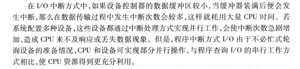

# 设备管理

[TOC]


## 1.	I/O硬件原理

### I/O系统

通常把I/O设备及其接口线路、控制部件、通道和管理软件称为I/O系统。

分类

按I/O操作特性：

- 输入型设备
- 输出型设备
- 存储型设备

按I/O信息交换单位：

- 字符设备：

  输入设备和输出设备(交换单位为字节)

- 块设备：

  存储设备，分为 顺序存储和直接存储

  前者严格依赖信息的物理位置进行定位和读写，如磁带；后者的特点是存储任何一个物理块所需时间几乎不依赖于此信息所处的位置，如磁盘。

  块：存储介质上连续信息所组成的一个区域，块设备每次与内存交换一块或多块信息。

### I/O控制方式

I/O控制是通过软硬件技术对CPU和设备的职能进行合理分工，以平衡系统性能和硬件成本之间的矛盾。分为：轮询、中断、DMA和通道，主要差别在于：CPU和设备并行工作的方式和程度不同。

- 轮询

  轮询方式又称为程序直接控制方式，使用查询指令测试设备控制器的忙闲状态位，确定内存和设备是否能交换数据。

  具体过程如下：

  1、CPU上运行的程序需要从设备读入一批数据，则CPU程序设置交换字节数和数据读入内存的起始地址

  2、然后向设备发出查询指令

  3、设备控制器便把状态返回给CPU

  4、如果设备忙碌或设备未就绪，则重复测试过程，继续进行查询；否者开始数据传送，CPU从I/O接口(数据寄存器)读取一个字，再用存储指令保存到内存。如果传送尚未结束，再次向设备发出查询指令，直到全部数据传输完成。

  评价：

  ```
  1、CPU轮询设备当前的状态会终止原程序的执行，浪费宝贵时间
  2、I/O准备就绪后，需要CPU参与数据传输工作
  可见CPU和设备只能串行工作，使主机不能充分发挥功效，设备也不能得到合理利用，整个系统效率低
  ```

  流程图：

  

- 中断方式

  **中断方式要求CPU与设备控制器及设备之间存在中断请求线，设备控制器的状态寄存器有相应的中断允许位**

  CPU与设备之间传输数据过程如下：

  

  评价：

  

  

  - DMA方式

    

    

    "周期占用"：

    若出现DMA与CPU同时经总线访问内存的情况，CPU总是把总线占用权让给DMA。

    "窃取时间"，通常为一个存取周期，让设备和内存之间交换数据，而不再需要CPU干预，这样可以减轻CPU负担。

    

  

  - 通道方式

    ​	DMA方式每次发出一次I/O指令，只能读写一个数据块，如果用户希望一次能够读写多个数据块，CPU就得发出多条启动I/O指令，并进行多次中断处理才能完成。

    ​	通道又称为I/O处理器，能够完成内存和设备之间的信息传送，与CPU并行地执行操作，把CPU从琐碎的I/O操作中解放出来，提高整个系统效率。

    

    ​	具有通道装置的计算机系统的主机、通道、控制器和设备之间采用四级链接，实施三级控制。一个CPU通常可以连接若干个通道，一个通道可以连接若干控制器，一个控制器可以连接若干设备。

    采用I/O通道设计后的I/O操作过程如下：

    CPU在执行主程序时遇到I/O请求，启动在指定通道上选址的设备，一旦启动成功，通道开始控制设备进行操作，这时CPU就可以执行其他任务并与通道并行工作，直到I/O操作完成；当通道发出I/O操作结束中断时，CPU才响应并停止当前工作，转而处理I/O操作结束事件。

### 设备控制器

​	I/O设备通常由机械部件和电子部件所组成，一般是将其分开处理，以达到模块化和通用性的设计目标。引入控制器的目的在于通过传递参数就可以执行I/O操作，大大地简化系统的设计，有利于计算机系统对各类控制器和设备的兼容性

设备控制器的主要功能是：

- 接收和识别CPU或通道发来的命令
- 实现数据交换。包括设备和控制器之间的数据传输，且通过数据总线或通道，控制器和内存之间传输数据。
- 发现和记录设备及自身的状态信息，供CPU处理使用
- 设备地址识别


设备控制器必须的组成部分：

- 控制寄存器及译码器
- 数据缓冲寄存器
- 状态寄存器
- 地址译码器及用于对设备操作进行控制的I/O逻辑

## 2. I/O软件原理

### I/O软件设计目标和原则

I/O软件的总体设计目的是**高效率和通用性**，需要考虑的问题有：

- 设备无关性
- 出错处理
- 同步/异步传输
- 缓冲技术

系统将I/O软件依次组织成4个层次：

- I/O中断处理程序
- I/O设备驱动程序
- 独立于设备的I/O软件
- 用户空间的I/O软件

### I/O中断处理程序

​	当进程请求I/O操作时，通常被挂起，直到数据传输结束并产生I/O中断时，系统接管CPU后转向中断处理程序执行：

- 检查设备状态寄存器内容，判断产生中断原因
- 根据I/O操作的完成情况进行相应处理
- 若数据传输有错，应向上层软件报告设备出错信息，实施重新执行
- 若正常结束，应唤醒等待传输的进程，使其转换为就绪态
- 若有等待传输的I/O命令，应通知相关软件启动下一个I/O请求

### I/O设备驱动程序


I/O设备驱动程序的工作过程：


设备驱动程序主要包含三部分功能：

- 设备初始化。在系统初次启动或设备传输数据时，预置设备和控制器以及通道的状态。
- 执行设备驱动例程。负责启动设备，进行数据传输，对于具有通道的I/O系统，此例程还负责生成通道指令和通道程序，启动通道工作。
- 调用和执行中断处理程序。负责处理设备和控制器及通道所发出的各种中断。

### 独立于设备的I/O软件

​	独立于设备的I/O软件和设备驱动程序之间的界限取决于具体系统，其基本功能是执行适用于所有设备的常用I/O功能，并向用户层软件提供一致性接口。

- 设备命名和设备保护

  ​	设备不仅具有文件名，且支持与文件相关的所有系统调用，如open()、close()、read()、write()及lseek()等

  ​	设备保护需要检查用户是否有权访问所申请的设备。

  ​	设备文件依赖于inode来实现，文件目录并不能区分文件名是代表一个磁盘文件还是设备文件，但inode的内容是不同的，磁盘文件的inode包含指向数据块的指针，而设备文件的inode则包含指向内核设备驱动程序的指针，用来控制设备的I/O操作


- 提供与设备无关的块尺寸

  


- 缓冲技术

  

  


- 设备分配和状态跟踪

  


- 错误处理和报告


### 用户空间的I/O软件

- 库函数

- SPOOLing软件

  

  


## 3. 缓冲技术


实现缓冲技术的基本思想：

​	当进程执行写操作输出数据时，先向系统申请一个输出缓冲区，然后将数据送至缓冲区，若是顺序写请求，则不断把数据填入缓冲区，直到装满为止，此后进程可以继续计算，同时，系统将缓冲区的内容写到设备上。当进程执行读操作输入数据时，先向系统申请一个输入缓冲区，系统将设备上的一条物理记录读至缓冲区，根据要求把当前所需要的逻辑记录从缓冲区中选中并传送给进程。

简而言之：

```
输出时，先扔给缓冲区，然后跑去做其他时
输入时，等设备缓冲区满了，再来读
```

等待：

​	1）输出数据时，仅当系统来不及腾空缓冲区而进程又要写数据；

​	2）输入数据时，仅当缓冲区为空而进程又要从中读数据。

**其他事件可以进一步提高CPU和设备间的并行性，设备和设备间的并行性，从而提高系统效率**

- 单缓冲区冲区

  

- 双缓冲区

  

  用两个缓冲区来交替读(写)


- 多缓冲区

  

  ​	两个缓冲仍然无法解决设备和进程速度不匹配的问题，进程要么处于写等待，要么处于读等待。

  ​	操作系统从内存区域中分配一组缓冲区，每个缓冲区都有一个链接指针指向下一个缓冲区，最后一个缓冲区指针指向第一个缓冲区，组成循环缓冲，缓冲区的大小等于物理记录的大小，多缓冲的缓冲区是系统的公共资源，可供进程共享并由系统统一分配和管理。

  

  缓冲区用途分为：

  - 输入缓冲区
  - 处理缓冲区
  - 输出缓冲区

  

  高速缓存(data buffer cache)：

  对于磁盘类的直接存取型设备，通常需要按照进程的要求随机地访问数据块，同一数据块可能会被多次访问，为了减少访问磁盘次数，避免数据项重复产生，内核建立一个数据缓冲区高速缓存，专门用于保存最近使用过的磁盘块。

  cache位于文件系统和磁盘设备驱动程序之间。

  cache的实现思想：

  

  

  

## 4. 驱动调度技术

### 存储设备的物理结构

### 循环排序

### 优化分布

### 搜查定位

- 先来先服务算法
- 最短查找时间优先算法
- 扫描算法
- 分步扫描算法
- 电梯调度算法
- 循环扫描算法


### 提高磁盘I/O速度的方法

- 提前读


- 延迟写


- 虚拟盘


### Linux磁盘I/O调度算法


## 5. 设备分配

### 设备独立性


### 设备分配及其数据结构

- 设备分配方式
- 设备分配的数据结构


## 6. 虚拟设备

### 背景

### SPOOLing设计与实现

### SPOOLing应用

## 7. Linux设备管理


