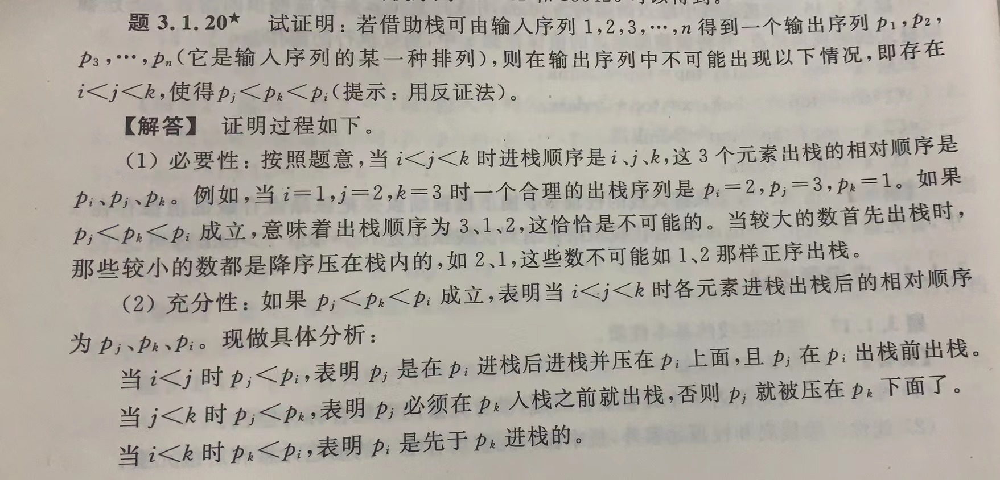

王道：

```
7、17、18、19、24、25、27
```




题型：

1、给出进栈顺序，判断合法的出栈顺序

```
逐个带入，如果有>=3连续入栈的，这些出来一定是相反顺序的
```

2、给出进栈顺序和出栈顺序，要求栈的最小容量

```
带入模拟一遍
```

3、给出进栈顺序和某几个出栈点的值，判断？


code:

1、共享栈

2、给定入栈序列，判断某个出栈顺序是否合法

```c
int Decision(int p[], int n) {
    Stack st;
    int i=1, k=0, j;
    s.push(i);
    do {
        j = st.top();
        if(j<p[k]) {
            i++;st.push(i);
        }
        else if(j == p[k]){
            j = st.pop();k++;
        }
        else {
            cout << "不合理";
        }
    }while(!s.isEmpty() && i <= n)
}
```

