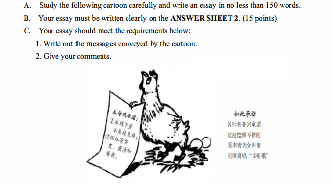

​	A hen is holding a notice promising that her eggs would be round and would contain egg shells，egg whites and yolks. Those promised qualities are only basic components  of eggs. How ridiculous it is!

​	Under the funny appearance hides a serious social problem that there are many meaningless promises which only reflect the basic responsibilities of the promise makers. Manufacturing units guarantee to turn out products of good quality; commercial enterprises swear to provide genuine commodities and enthusiatic services; administration departments assure to perform their tasks effectively and fairly without taking any bribery.

​	Such promises are deceptive to the public. The hen and her likes should know that by dishonest words no one could survice the intense competition under market economy system. On one hand, people engaged in providing all kinds of services should honestly inform their customers of the services that they can enjoy because mutual trust is the foundation of business. They should remember the old saying,"Honesty is the best policy." On the other hand, necessary laws and regulations should be adopted and enforced to ensure a trust-worthy economic and social environment. Only in these ways, can both parties, service providers and those served, enjoy a healthy atmosphere of mutual trust.

一只母鸡举着牌子承若她的鸡蛋会是圆的，且包括蛋壳，蛋清和蛋黄。这些承若的品质只是鸡蛋的基本成分。多可笑啊！

在滑稽的外表下隐藏着一个严重的社会问题：存在许多只反映承若者基本职责的无意义承若。生产商承若生产质量好的物品；工商企业发誓提供真货和热情服务；政府部门保证不贪污，有效、公平地履行职责。

这样的承若是对大众的欺骗。这只母鸡和像他一样的人应该知道不诚实的人无法在市场经济体系激烈的竞争中存活。首先，提供各种服务的人们应该诚实地告知客户他们能享受的服务，因为互相信任是交易的基础。他们应该记住一句老话："诚实至上"。另外，应该采用和加强必要的法律和规则，以保证值得信赖的经济和社会环境。只有这样，提供服务和接受服务这两种人才能享受互相信任的健康氛围。