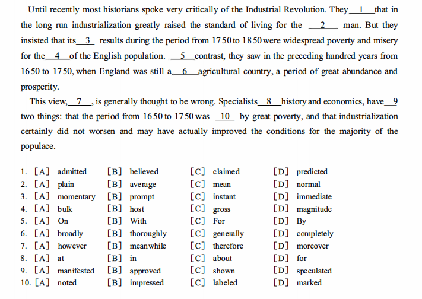

完型：
语法，语境

believe相信认定，(把某事)当真
claim

2、
plain、average、mean、normal

3、
momentary瞬间的，刹那间的
prompt敏捷的，迅速的，即时的
instant立即的，即刻的
immediate迅速的，直接的

4、
bulk of主要部分，大部分
host of许多
gross of一罗(12打，144)
magnitude of巨大，重大(性)

5、contrast
by contrast,
in contrast with/to

6、
broadly大体上，概括地，广泛地
generaly通常地，一般地，普遍地
thoroughtly彻底地
completely完全地

7、
however然而，转折
meanwhile同时，表时间
therefore因此，因果
moreover而且，递进

8、
in可以表示 "在...方面;从事...职业;进行...活动"
specialists/experts in history
specialize in math 擅长数学

9、
manifested 表现，显示
approved 同意，批准，赞同
shown指出，显示，说明
speculated推测，思索

10、
was noted（for/as)因...而著名
was impressed (by)对...留下深刻印象
was labeled as 被视为...，被称作...
was marked (by)具有...的特征

Learning:
critically 批判性地，严重地
Industrial Revolution 工业革命
in a long run 从长远看
industialization 工业化
raise/rise
the stardard of living for people
poverty ans misery 贫困和苦难
preceding 在前的，上诉的
agricultural 农业的
a period of great abundance and properity 丰盛和繁荣
specailists in history and economic
certainly 当然，肯定，无疑

speak - spoke - spoken - speaking
speak for  代表...发言，为...辩护，要求，预定
speak of   谈起，提到，为...提供证据，显露出
speak volume for 充分说明
so to speak 恕我直言，可以说